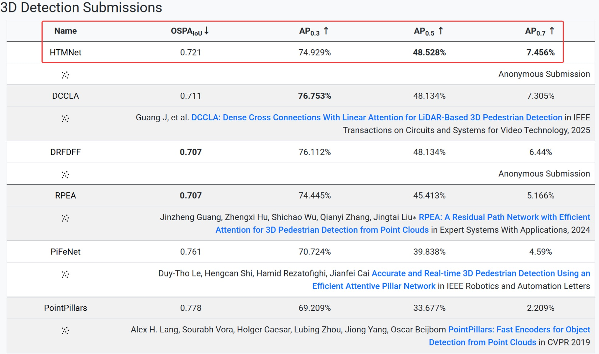
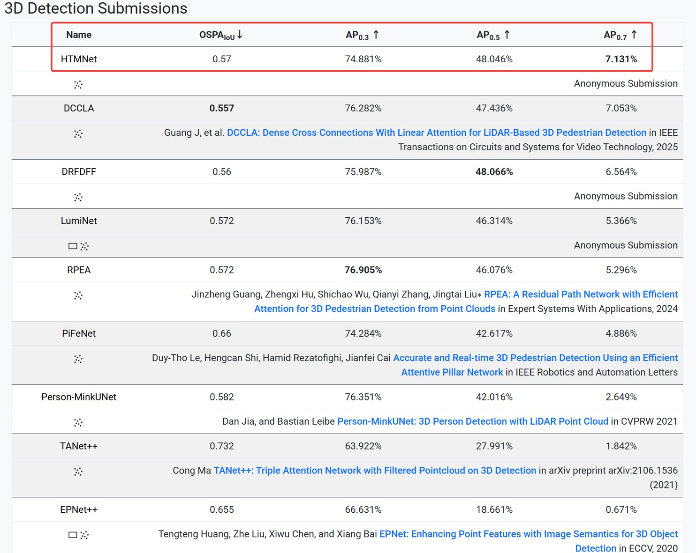

# HTMNet

Official PyTorch implementation of HTMNet: A Hybrid Transformer-Mamba Network for LiDAR-based 3D Detection and Semantic Segmentation

### [https://www.youtube.com/watch?v=_7OWfAxLXQs](https://www.youtube.com/watch?v=_7OWfAxLXQs)


[](https://youtu.be/_7OWfAxLXQs "")

## Experimental Results

### 3D Detection

Our HTMNet ranks first on [JRDB 2022](https://jrdb.erc.monash.edu/leaderboards/detection22) and [JRDB 2019](https://jrdb.erc.monash.edu/leaderboards/detection) 3D detection leaderboards.

|           Model           | AP (JRDB 2022) | AP (JRDB 2019) | 
|:-------------------------:|:--------------:|:--------------:|
| RPEA   |    45.413%     |    46.076%     | 
|           HTMNet (Ours)           |    48.528%     |    48.046%     | 
|        Improvement        |    +3.115%     |    +1.970%     | 
|       Our Checkpoint        |    [HTMNet_JRDB2022.pth](https://github.com/jinzhengguang/HTMNet/releases/download/v1.0/HTMNet_JRDB2022.pth)     |    [HTMNet_JRDB2019.pth](https://github.com/jinzhengguang/HTMNet/releases/download/v1.0/HTMNet_JRDB2019.pth)     | 


## News

- **(2025-08-29)** 🔥 We release the code and model of our HTMNet.

- **(2025-08-07)** 🏆 Our HTMNet ranks first on [JRDB 2022 3D Detection Leaderboard](https://jrdb.erc.monash.edu/leaderboards/detection22).



- **(2025-08-07)** 🏆 Our HTMNet ranks first on [JRDB 2019 3D Detection Leaderboard](https://jrdb.erc.monash.edu/leaderboards/detection).




## Requirements

- `python==3.11`
- `PyTorch==2.7.0`
- `cuda==12.8`
- `torchsparse==1.2.0` [(link)](https://github.com/mit-han-lab/torchsparse)

```shell
python setup.py develop
cd lib/iou3d
python setup.py develop
cd ../jrdb_det3d_eval
python setup.py develop
```


## JRDB dataset

Download [JRDB dataset](https://jrdb.erc.monash.edu/) under `PROJECT/data`.

```shell
# convert_labels_to_KITTI
python lib/jrdb_devkit/detection_eval/convert_labels_to_KITTI.py
# train
python train.py --cfg htmnet19.yaml
# validation
python train.py --cfg htmnet19.yaml --ckpt HTMNet_JRDB2019.pth --evaluation
```


## Acknowledgement

- DCCLA [(link)](https://github.com/jinzhengguang/DCCLA)
- RPEA [(link)](https://github.com/jinzhengguang/RPEA)
- Person_MinkUNet [(link)](https://github.com/VisualComputingInstitute/Person_MinkUNet)
- torchsparse [(link)](https://github.com/mit-han-lab/torchsparse)
- PointRCNN [(link)](https://github.com/sshaoshuai/PointRCNN)


## Contact Information

If you have any suggestion or question, you can leave a message here or contact us directly: guangjinzheng@qq.com. Thanks for your attention!
